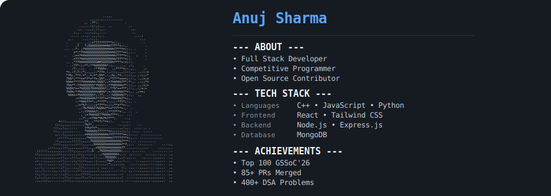

  

---

# **PROJECTS**
<table border="1" cellspacing="0">
<tr>

<td width="400" valign="top">

## Task Manager

A full-stack MERN task management application with JWT authentication, dark/light theme, and a responsive UI.

**Tech Stack:** React • Tailwind CSS • Node.js • Express • MongoDB

</td>

<td width="400" valign="top">

## MockSpire

An AI-powered mock interview platform that helps users practice interviews with real-time feedback.

**Tech Stack:** React • Tailwind CSS • Node.js • Express • MongoDB • Gemini API

</td>

</tr>
</table>

---

# **CONNECT**

---

  <h3> ⭐ Consistency compounds. Every contribution counts. </h3>

